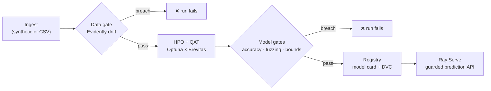

# MLOps Production Pipeline

[](https://github.com/FrankAsanteVanLaarhoven/mlops-production-pipeline/actions/workflows/ci.yml)
[](pyproject.toml)
[](LICENSE)
[](pyproject.toml)

An end-to-end machine-learning production pipeline in which **no model ships unless it
passes explicit quality gates**. It covers the full lifecycle — data ingestion, drift
detection, hyperparameter search, quantization-aware training, robustness validation,
versioned registration with full lineage, and a schema-guarded serving API — with each
stage enforced in code, not left to convention.



## Design principles

1. **Gates, not vibes.** Data drift, accuracy, perturbation robustness, and output-bound
   safety are hard failures with configurable thresholds. A breached gate stops the run
   before a model can be registered or served.
2. **Core logic is framework-free.** Everything that matters (data, training,
   validation, registry) is plain Python — unit-tested in seconds without an
   orchestrator. ZenML steps and the Ray Serve deployment are thin adapters around it.
3. **One config describes a run.** Every threshold, search range, seed, and path lives
   in [`configs/pipeline.yaml`](configs/pipeline.yaml). No magic numbers in pipeline code.
4. **Every model carries its lineage.** Registration writes an immutable version
   directory with a model card: metrics, hyperparameters, data fingerprint, git commit,
   and framework versions. Serving reports which version answered each request.
5. **The serving boundary is a contract.** Requests and responses are validated against
   Pydantic schemas (wrapped by Guardrails AI when installed); malformed and
   out-of-distribution inputs are rejected with structured 4xx errors before they reach
   the model.

## Stack

| Concern | Tool | Where |
|---|---|---|
| Orchestration | [ZenML](https://zenml.io) | `pipeline.py`, `steps.py` |
| Hyperparameter search | [Optuna](https://optuna.org) (TPE, seeded) | `training.py` |
| Quantization-aware training | [Brevitas](https://github.com/Xilinx/brevitas) + PyTorch | `model.py`, `training.py` |
| Data drift & quality | [Evidently](https://evidentlyai.com) | `validation.py` |
| Artifact versioning | [DVC](https://dvc.org) | `registry.py` |
| Serving | [Ray Serve](https://docs.ray.io/en/latest/serve/) | `serving.py` |
| I/O contracts | Pydantic + [Guardrails AI](https://guardrailsai.com) | `schemas.py`, `serving.py` |

## Quality gates

| Gate | Check | Default threshold | Config key |
|---|---|---|---|
| Data | Share of drifted features (Evidently) | < 30 % | `gates.max_drifted_share` |
| Performance | Held-out accuracy | ≥ 85 % | `gates.min_accuracy` |
| Robustness | Prediction consistency under Gaussian input noise (σ = 0.05) | ≥ 90 % | `gates.min_noise_consistency` |
| Safety | Output probabilities stay in [0, 1] on extreme inputs (±10⁶, zeros) | always | — |

A breached gate raises `GateFailure` listing **every** breach at once, so a failed run
tells you everything that is wrong in a single pass.

The same limits guard the serving path: requests with the wrong feature count or with
out-of-distribution values (`|x| > serving.max_abs_feature_value`) are rejected with
HTTP 400 before inference.

## Quickstart

Requires Python ≥ 3.12 and [uv](https://docs.astral.sh/uv/).

```bash
git clone https://github.com/FrankAsanteVanLaarhoven/mlops-production-pipeline.git
cd mlops-production-pipeline

make install    # uv sync --group dev
make test       # fast unit suite (no orchestration stack needed)
make train      # full pipeline: ingest → gates → HPO/train → gates → register
make serve      # serve the latest registered model on :8000
```

Two compatibility choices are pinned in `pyproject.toml` deliberately:

- On Linux, `torch` resolves from the CPU-only PyTorch index — this workload is a
  small quantized MLP and does not need CUDA. Override `[tool.uv.sources]` for GPU builds.
- `protobuf<7`, because Ray Serve 2.52 still reads `FieldDescriptor.label`, which
  protobuf 7 removed.

Query the API:

```bash
# Liveness + which model version is serving
curl http://localhost:8000/health

# Prediction
curl -X POST http://localhost:8000/predict \
  -H 'Content-Type: application/json' \
  -d '{"features": [0.5, -0.2, 0.1, 0.4, 0.0, -0.1, 0.3, 0.2, -0.4, 0.8]}'
```

Or run the built-in smoke test, which deploys, sends valid / malformed /
out-of-distribution requests, asserts the expected status codes, and exits non-zero on
any mismatch:

```bash
make smoke
```

## Configuration

A run is fully described by one YAML file (defaults shown trimmed):

```yaml
seed: 42

data:
  source: synthetic        # synthetic | csv
  n_samples: 2000
  n_features: 10
  test_size: 0.2

training:
  n_trials: 20             # Optuna trials
  epochs: 100
  lr: { low: 1.0e-3, high: 1.0e-1, log: true }
  weight_bit_width: { low: 4, high: 8 }
  hidden_dim: { low: 4, high: 32 }

gates:
  max_drifted_share: 0.3
  min_accuracy: 0.85
  min_noise_consistency: 0.90

registry:
  root: artifacts/registry
  dvc_track: true
```

Config is parsed into typed, validated Pydantic models (`config.py`) — a typo'd key or
an inverted search range fails at load time, not mid-run.

**Bring your own data:** point `data.source: csv` at any CSV with numeric feature
columns and a binary target column; the rest of the pipeline (drift gate, HPO,
validation, registry, serving) is unchanged.

## Model registry & lineage

Every model that clears the gates is registered under an immutable version:

```
artifacts/registry/
├── latest.json                        # → serving pointer
└── v20260707-023609-e78373a/
    ├── model.pt                       # weights + architecture (self-describing)
    └── card.json                      # full lineage
```

The model card records everything needed to audit or reproduce the model
(values below are from a real run of the default config):

```json
{
  "version": "v20260707-023609-e78373a",
  "git_commit": "e78373a",
  "data_fingerprint": "f1d336f3da151b96",
  "architecture": { "n_features": 10, "hidden_dim": 26, "weight_bit_width": 6 },
  "hyperparameters": { "lr": 0.0171, "weight_bit_width": 6, "hidden_dim": 26 },
  "metrics": { "accuracy": 0.995, "noise_consistency": 0.99, "outputs_bounded": true },
  "drift_share": 0.0,
  "framework_versions": { "torch": "2.12.1+cpu", "brevitas": "0.12.1" }
}
```

With `registry.dvc_track: true`, the registry directory is tracked by DVC, so model
binaries stay out of git while the pointer files stay in it — add a
[DVC remote](https://dvc.org/doc/user-guide/data-management/remote-storage) to push
artifacts to S3/GCS/Azure.

## Serving API

`mlops-serve` loads whatever `latest.json` points at (override with
`--registry-root` or `MODEL_REGISTRY_ROOT`).

| Route | Method | Purpose |
|---|---|---|
| `/health` | GET | Liveness, serving model version, registered metrics |
| `/predict` | POST | Guarded inference |

Every response includes the model version that produced it:

```json
{ "predicted_class": 1, "probability": 0.87, "model_version": "v20260707-142530-e78373a" }
```

| Failure | Status |
|---|---|
| Non-JSON body, wrong feature count, non-numeric features | 400 |
| Out-of-distribution feature values | 400 |
| Response violating the output contract | 500 |

## Testing

```bash
make test        # unit suite: config, data, model, training, validation, registry, schemas
make test-all    # + end-to-end ZenML pipeline run (marked `integration`)
make lint        # ruff
```

The unit suite trains real (tiny) quantized models — no mocked ML — and still finishes
in well under a minute on CPU. CI runs lint and the unit suite on every push and PR.

## Docker

```bash
make train          # produce a registered model first
make docker-build
make docker-serve   # mounts ./artifacts/registry read-only, serves on :8000
```

## Project structure

```
├── configs/pipeline.yaml        # single source of truth for a run
├── src/mlops_pipeline/
│   ├── config.py                # typed config (Pydantic + YAML)
│   ├── data.py                  # sources, split, content fingerprint
│   ├── model.py                 # quantized MLP factory, checkpoint I/O
│   ├── training.py              # Optuna HPO + final training
│   ├── validation.py            # drift, accuracy, fuzzing, boundary gates
│   ├── registry.py              # versioned registry + model cards + DVC
│   ├── schemas.py               # serving request/response contracts
│   ├── steps.py                 # thin ZenML step adapters
│   ├── pipeline.py              # pipeline definition + `mlops-train` CLI
│   └── serving.py               # Ray Serve deployment + `mlops-serve` CLI
├── tests/                       # unit suite + integration pipeline test
├── .github/workflows/ci.yml     # lint + tests on push/PR
├── Dockerfile                   # serving image
└── Makefile                     # install · lint · test · train · serve · smoke
```

## Roadmap

- [ ] DVC remote + scheduled retraining workflow
- [ ] Post-deployment drift monitoring against the training reference (Evidently)
- [ ] Canary rollout between registry versions behind Ray Serve
- [ ] ONNX export path for the quantized model (edge deployment)
- [ ] Prometheus metrics endpoint on the serving layer

## License

[MIT](LICENSE) © Frank Asante Van Laarhoven
